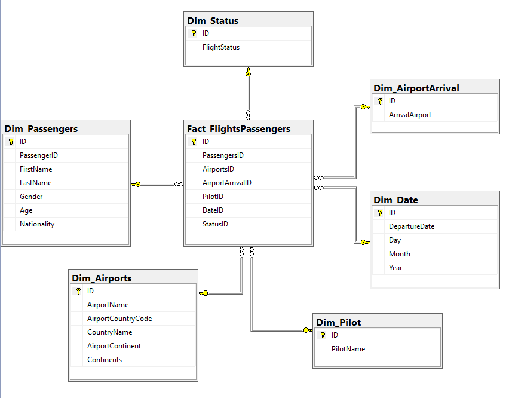
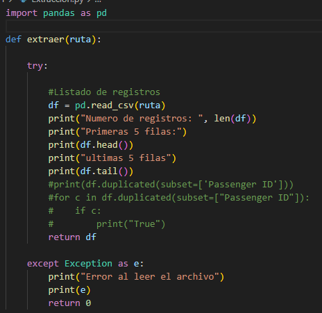
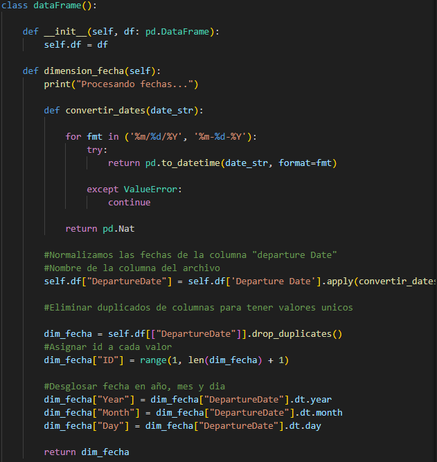
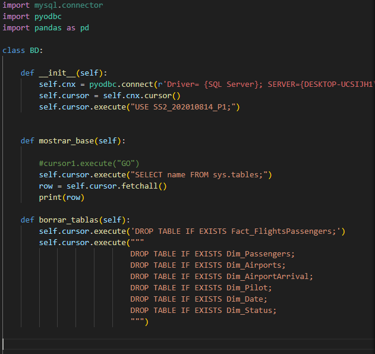

# Diagrama del modelo realizado

Para crear el modelo se opto por el estrella ya que esto facilitaba el acceso a los datos para realizar las consutltas.

## Tabla pasejeros
Se creo un ID para los datos existentes ya que el tener una llave foranea como entero facilita el acceso a los datos.

## Tabla estados
Esta tabla almacenara el estado de los vuelos.

## Tabla aeropuerto
Esta tabla almacenara los datos de los aeropuertos.

## Tabla piloto
Esta tabla almacenara el nombre de los pilotos.

## Tabla fecha
Esta tabla almacenara las fechas en que se realizaron los vuelos. Ademas se descompone en dia, mes y año para llevar un mejor registro de las consultas que se hagan.

## Tabla aeropuerto llegada 
Esta tabla almacenara el aeropuerto destino, no se almaceno en la tabla aeropuerto ya que si existieran mas datos seria mejor tenerlas separas por salida y llegada.

# Manual tecnico de la aplicacion

## LIbrerias utilizadas

* Pandas: Se utilizo para realizar la extraccion de los datos del archivo .csv
* pyodbc: Se utilizo para realizar la conexion a la base de datos en sql server.

## Extraer

Se tiene una funcion llamada extraer que se encarga de extraer todos los datos almacenados en el archivo .csv utilizando la libreria Pandas.

## Transformacion

Se tiene una clase dataframe el cual tiene funciones para realizar la transformacion de los datos que se almacenaran para cada tabla. Las funciones son las siguientes:

* def dimension_fecha: Esta funcion primero realiza una limpieza para los datos de la fecha, convirtiendolos en el formato correcto para almacnarlo en la base de datos. De ultimo se crea un dataframe con los valores que deseamos almacenar en la tabla.

* def dimension_pasajeros: Esta funcion primero elimina los datos duplicados que puedan existir antes de crear el dataframe con los datos que se almacenaran en la base de datos, tambien se crea un ID para cada registro que exista.

* def dimension_aeropuertos: Esta funcion convierte los atributos Airport Country Code y Airport Continent en mayuscula para tener un estandar en todos los registros. Luego se verifica que no haya duplicados y asignarles un ID para crear el dataframe con los datos que se almacenaran en la base de datos

* def dimension_aeropuertoLlegada: Esta fucnion primero realiza una conversion de los datos de Arrival Airport para tener un estandar y que esten en mayusculas. Luego se eliminan los duplicados para asignarles un ID unico y despues crear un dataframe con los datos que se almacenaran en la base de datos.

* def dimension_piloto: Esta funcion verifica que no existan datos duplicados para asignar un ID unico y despues crear un dataframe para almacenar los datos en la base de datos.

* def tabla hechos: Esta funcion recibe todos los dataframes de las tablas dimensiones creadas para asignar los ID en cada atributo y cada registro de todos los datos extraidos.

## Carga

Se tiene una clase BD que realiza la conexion a la base de datos y tambien realiza la carga del modelo, eliminar el modelo y tambien realiza las consultas.

