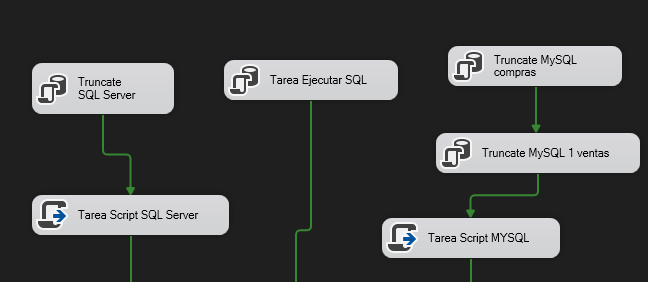
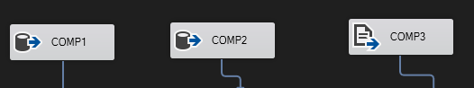
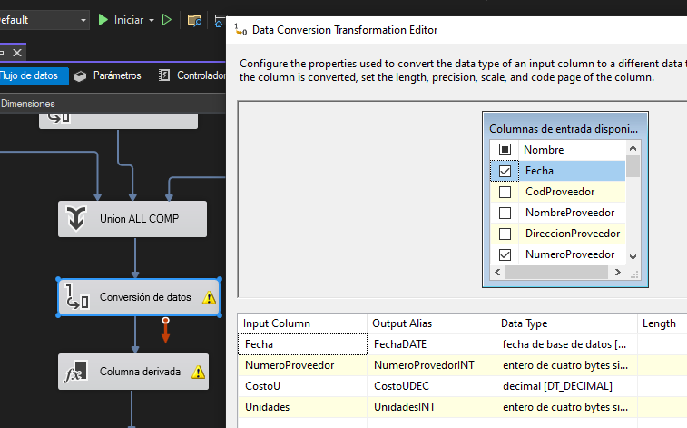
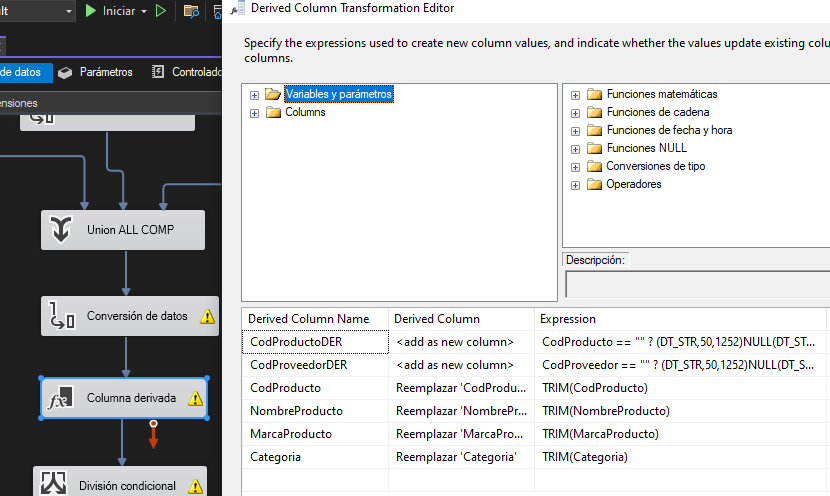
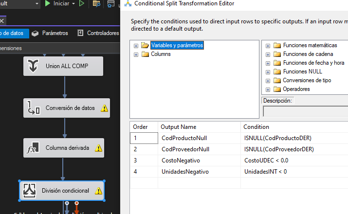
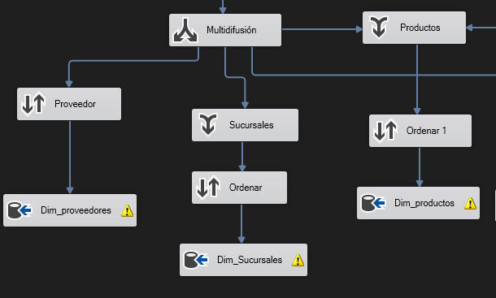
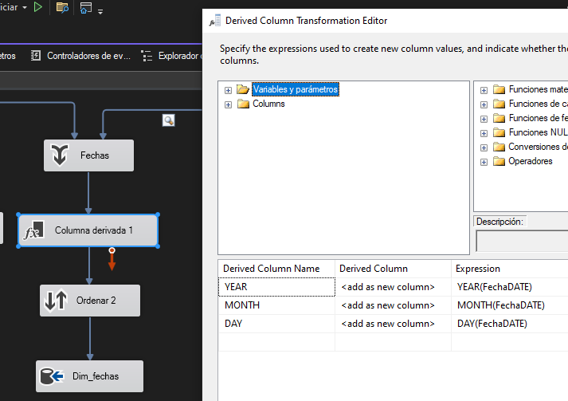
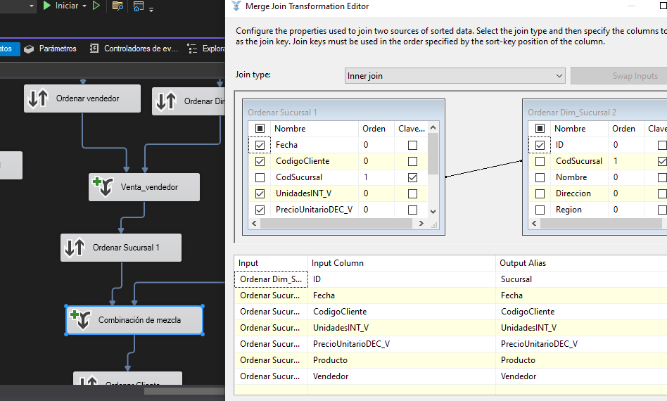
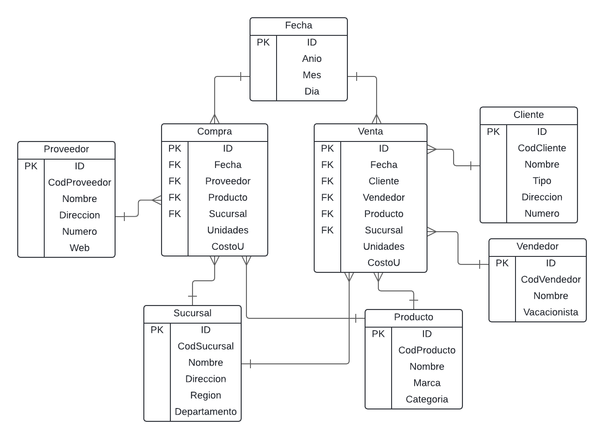
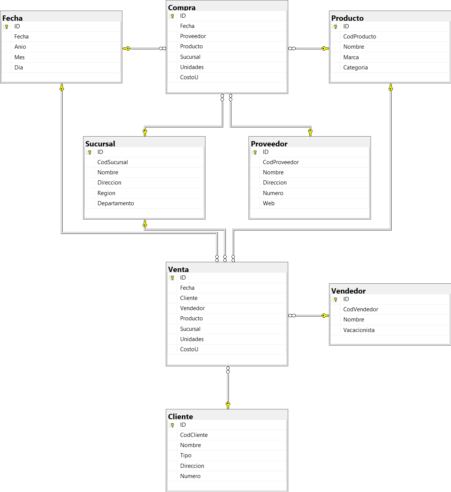

# Documentación

## Herramientas

- SQL Server: Se utilizo esta base de datos para almacenar los datos temporales antes de realizar la transformación. Tambien se utilizó para el datawarehouse

- MYSQL: Se utilizo esta base de datos para almacenar los datos temporales antes de realizar la transformación.

- Visual Studio: Herramientna de desarrollo, donde se utilizo dependencias de SSIS para el proceso ETL y diseño del datawarehouse

## Extraccion

Para realizar la extraccion en SQL Server  se tilizo el componente "Tarea Script". El flujo es el siguiente

1. Se realiza una limpieza de datos en las tablas pivote de SQL Server y MYSQL. 
2. Luego con la Tarea Script se crea un script en C# para almacenar los datos en las tablas.

Para los archivos planos se utilizo el componente "Origen de archivo plano"  y se selecciono el archivo guardado de manera local. Con esto se conforman 3 fuentes para archivos, uno del archivo plano, una de MYSQL y una de SQL Server.

## Transformacion

Para la transformación de los datos se utilizo un "conversor de datos" para cambiar el tipo de los datos. Un "Columna Derivada" para encontrar valores vacios. Un "Division condicional" para desechar valores nulos.

- Se convierte la fecha en un valor Date para poder ingresarlo a la tabla dimension. 
- Se convierte el numeroProveedor a INT para omitir valores vacios y nulos, si existe error se redirige la fila.
- Se convierte el costo a decimal y las unidades a un valor entero para hacer validaciones posteriores.

- Se valida si viene vacio el CodProducto para pasarlo a tipo nulo.
- Se hace un trim a CodProducto, NombreProducto, MarcaProducto y Categoria para eliminar posibles espacios en blanco al inicio y final de la cadena.

Ya habiendo realizado las transformaciones anteriores, aqui validamos que si CodProducto y CodProveedor sea nulo se omitan. Y si Costo y Unidades son valores negativos tambien se omiten.

Todo este proceso tambien se realizo para las ventas

## Carga

Para la carga en las tablas dimensiones se utiliza el componente "Ordenar" par eliminar los valores duplicados y un "Destino ADO NET" para insertar en sus respectivas tablas.

Tambien se utilizo un componente "Union" por si vienen datos de la fuente de ventas.

Tambien se utilizo una Columna Derivada para las fechas y asi obtener el valor del año, mes y dia antes de insertarlo en la tabla dimension Fecha.

Para la carga en las tablas hechos se utilizo una combinacion entre los componentes Ordenar, Origen ADO NET para obtener los valores de las tablas dimensionens y un Merge Join para unir los valores de la tabla original y las dimensiones. Por utlimo se inserta en las tablas correspondientes utilizando el Destino ADO NET.

## Modelo

Se trabajo un MOdelo Constelacion debido a la facilidad de manejar dos tablas de Hechs para poder llevar  de manera separada las Ventas y Compras, pero pudiendo compartir dimensiones como lo son Fecha, Sucursal y Producto.

